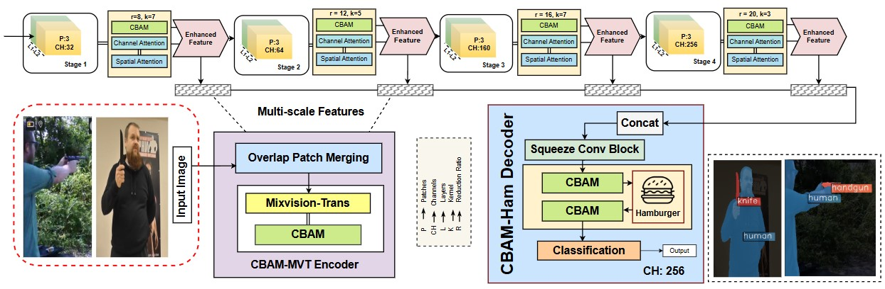

# ArmFormer: Lightweight Transformer Architecture for Real-Time Multi-Class Weapon Segmentation and Classification




## Overview

ArmFormer is an advanced semantic segmentation architecture designed for thermal and RGB weapon detection. The model integrates **Convolutional Block Attention Module (CBAM)** with **Mix Vision Transformer (MViT)** backbone and **Light Harmonic Aggregation Module (LightHAM)** decoder to achieve superior detection performance.

### Key Features

* **CBAM-Enhanced MViT Backbone**: Combines transformer-based hierarchical feature extraction with channel and spatial attention mechanisms
* **LightHAM Decoder with Attention**: Efficient multi-scale feature aggregation enhanced with CBAM attention
* **Multi-Class Weapon Detection**: Supports detection of handguns, rifles, revolvers, knives, and human subjects
* **Optimized for Resource Efficiency**: Designed for deployment on edge devices and resource-constrained platforms
* **Thermal and RGB Support**: Works with both thermal and RGB imagery

## Architecture Components

### Backbone: CBAM-Enhanced Mix Vision Transformer
- Hierarchical transformer encoder with 4 stages
- CBAM attention modules after each transformer stage
- Overlap patch merging for spatial continuity
- Multi-scale feature extraction

### Decoder: CBAM-Enhanced Light Hamburger Module
- Lightweight Harmonic Aggregation Module (LightHAM)
- CBAM attention integration (pre-HAM and post-HAM)
- Efficient multi-scale feature fusion
- Reduced computational complexity

## Getting Started

### Installation

**Step 1: Clone the Repository**

```bash
git clone https://github.com/yourusername/armformer.git
cd armformer
```

**Step 2: Environment Setup**

Create and activate a conda environment:

```bash
conda create -n armformer python=3.8
conda activate armformer
```

**Step 3: Install Dependencies**

Install PyTorch with CUDA support:

```bash
conda install pytorch torchvision torchaudio pytorch-cuda=11.8 -c pytorch -c nvidia
```

Install MMSegmentation and dependencies:

```bash
pip install -U openmim
mim install mmengine
mim install "mmcv>=2.0.0,<2.2.0"
```

**Important Note:** After installing mmengine, manually update the MMCV version constraint:

```python
# In mmseg/__init__.py
MMCV_MAX = '2.2.1'
```

Install additional requirements:

```bash
pip install -r requirements.txt
```

### Dataset Preparation

ArmFormer is designed for thermal/RGB weapon detection datasets. Organize your dataset as follows:

```
data/
├── train/
│   ├── images/
│   └── mmseg_masks/
├── validation/
│   ├── images/
│   └── mmseg_masks/
└── test/
    ├── images/
    └── mmseg_masks/
```

Update the `data_root` path in `local_configs/_base_/datasets/thermal_rgb.py` to point to your dataset location.

### Training

**Command Line Training**

```bash
python tools/train.py local_configs/armformer_config.py
```

**Jupyter Notebook Training**

Navigate to the notebooks directory and open `train.ipynb`:

```bash
cd notebooks
jupyter notebook train.ipynb
```

The notebook provides an interactive interface to:
- Load and customize the configuration
- Set working directories
- Monitor training progress
- Visualize results

### Evaluation

**Command Line Evaluation**

```bash
python tools/test.py local_configs/armformer_config.py /path/to/checkpoint.pth --eval mIoU
```

**Jupyter Notebook Evaluation**

Open `test.ipynb` in the notebooks directory for evaluation tasks:

```bash
cd notebooks
jupyter notebook test.ipynb
```

The test notebook includes cells for:
- Basic testing and evaluation
- Performance benchmarking
- FLOPs calculation
- Confusion matrix generation

## Model Configuration

### Dataset Classes

The Thermal_RGBDataset supports the following classes:
- Background
- Handgun
- Human
- Knife
- Rifle
- Revolver

### Training Configuration

Key training parameters in `armformer_config.py`:

- **Optimizer**: AdamW with learning rate 0.00006
- **Training iterations**: 160,000
- **Batch size**: 2 (training), 1 (validation/test)
- **Input size**: 512×512
- **Learning rate schedule**: Linear warmup + Polynomial decay
- **Validation interval**: Every 8,000 iterations

### Model Architecture Parameters

**Backbone (CBAM-MViT)**:
- Embedding dimensions: 32
- Number of stages: 4
- Number of layers per stage: [2, 2, 2, 2]
- Number of heads: [1, 2, 5, 8]
- CBAM reduction ratios: [16, 16, 16, 16]
- CBAM kernel sizes: [7, 7, 7, 7]

**Decoder (CBAM-LightHAM)**:
- Input channels: [64, 160, 256]
- HAM channels: 256
- CBAM position: pre_ham
- Number of classes: 6

## Project Structure

```
armformer/
├── local_configs/           # Configuration files
│   ├── _base_/
│   │   ├── datasets/       # Dataset configurations
│   │   └── models/         # Model configurations
│   └── armformer_config.py # Main config file
├── mmseg/                   # Model implementations
│   ├── datasets/           # Custom dataset definitions
│   └── models/             # CBAM modules and architectures
├── notebooks/               # Jupyter notebooks
│   ├── train.ipynb         # Training notebook
│   └── test.ipynb          # Testing notebook
├── tools/                   # Training and testing scripts
│   ├── train.py
│   └── test.py
├── requirements/            # Dependency specifications
├── requirements.txt         # Main requirements file
├── LICENSE                  # MIT License
└── README.md               # This file
```

## Custom Components

### CBAM Attention Module

The CBAM (Convolutional Block Attention Module) enhances feature representation through:

1. **Channel Attention**: Uses average and max pooling to capture channel-wise relationships
2. **Spatial Attention**: Applies convolutions on channel-pooled features to learn spatial attention

### Integration Points

ARMFormer integrates CBAM at multiple locations:
- After each MixVisionTransformer stage in the backbone
- Before the Hamburger module in the decoder (pre_ham position)

## Performance Tips

1. **GPU Memory**: Adjust batch size based on available GPU memory
2. **Multi-GPU Training**: Use distributed training for faster convergence
3. **Data Augmentation**: Enabled by default with random resizing, cropping, and flipping
4. **Learning Rate**: Fine-tune based on dataset size and complexity

<!-- ## Citation

If you use ARMFormer in your research, please cite:

```bibtex
@article{armformer2025,
  title={ARMFormer: Attention-Refined Mix Vision Transformer for Thermal Weapon Detection},
  author={Your Name},
  journal={arXiv preprint},
  year={2025}
}
``` -->

## License

This project is licensed under the MIT License - see the [LICENSE](LICENSE) file for details.

<!-- ## Acknowledgments

- Built on top of [MMSegmentation](https://github.com/open-mmlab/mmsegmentation)
- Inspired by [SegFormer](https://github.com/NVlabs/SegFormer) and [HamNet](https://github.com/Gsunshine/Enjoying-Hamburger)
- CBAM implementation based on ["CBAM: Convolutional Block Attention Module"](https://arxiv.org/abs/1807.06521) -->

## Contact

For questions and feedback, please open an issue on GitHub or contact the authors.

<!-- ---

**Note**: This is a research project. For production deployment, please conduct thorough testing and validation on your specific use case. -->

